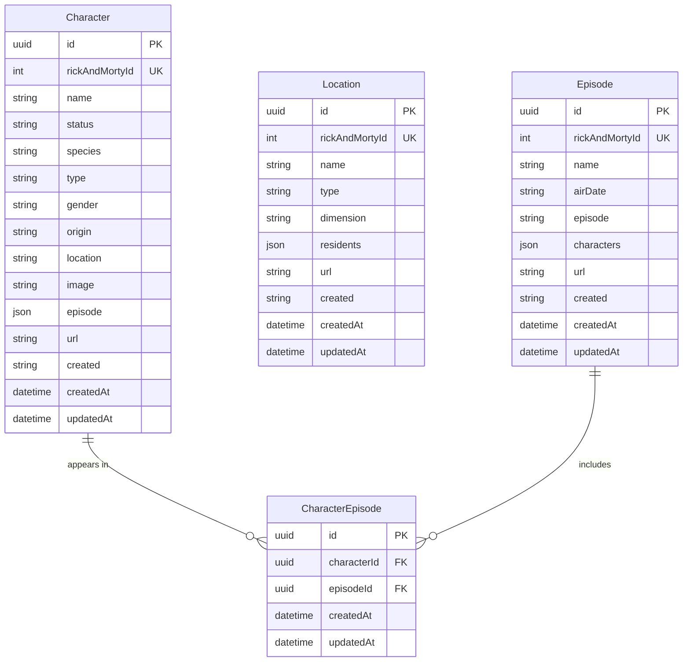

# Rick and Morty API Database ERD

## Description

The database for the Rick and Morty API consists of the following tables:

### Character

Stores information about Rick and Morty characters.

- **id**: Unique identifier (UUID)
- **rickAndMortyId**: Original ID from the Rick and Morty API
- **name**: Character name
- **status**: Character status (Alive, Dead, or Unknown)
- **species**: Character species
- **type**: Additional type information
- **gender**: Character gender
- **origin**: Character's place of origin
- **location**: Character's last known location
- **image**: URL to character's image
- **episode**: JSON array of episode URLs the character appears in
- **url**: URL to the character in the Rick and Morty API
- **created**: Creation timestamp from the API
- **createdAt/updatedAt**: Database record timestamps

### Location

Stores information about locations in the Rick and Morty universe.

- **id**: Unique identifier (UUID)
- **rickAndMortyId**: Original ID from the Rick and Morty API
- **name**: Location name
- **type**: Location type
- **dimension**: Location dimension
- **residents**: JSON array of character URLs that live in this location
- **url**: URL to the location in the Rick and Morty API
- **created**: Creation timestamp from the API
- **createdAt/updatedAt**: Database record timestamps

### Episode

Stores information about episodes of the show.

- **id**: Unique identifier (UUID)
- **rickAndMortyId**: Original ID from the Rick and Morty API
- **name**: Episode name
- **airDate**: Date the episode was aired
- **episode**: Episode code (e.g., S01E01)
- **characters**: JSON array of character URLs that appear in the episode
- **url**: URL to the episode in the Rick and Morty API
- **created**: Creation timestamp from the API
- **createdAt/updatedAt**: Database record timestamps

### CharacterEpisode

Junction table to represent the many-to-many relationship between characters and episodes.

- **id**: Unique identifier (UUID)
- **characterId**: Foreign key referencing the Character table
- **episodeId**: Foreign key referencing the Episode table
- **createdAt/updatedAt**: Database record timestamps
